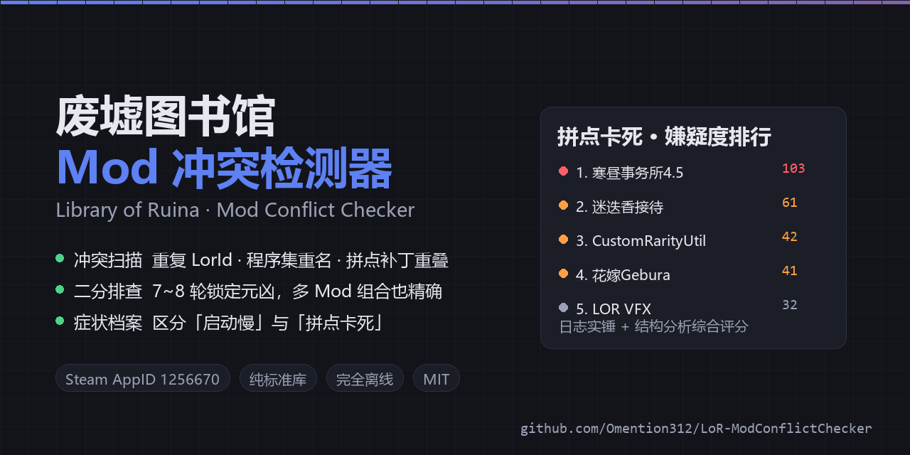

# 废墟图书馆 Mod 冲突检测器

[](https://github.com/Omention312/LoR-ModConflictChecker/actions/workflows/ci.yml)
[](LICENSE)



针对 **Steam 版《废墟图书馆 / Library of Ruina》**（AppID `1256670`）的 Mod 冲突检查工具，包含三部分：

1. **冲突扫描** —— 自动找到你的游戏、创意工坊 Mod 目录和 `Player.log`，列出会导致崩溃 / 卡死的 Mod 冲突。
2. **二分排查** —— 当报告里同时有好几个可疑项、无法确定是哪一个时，用交互式的开关实验
   一步步把范围缩小，最终**用实验确认**到底哪几个 Mod 是元凶。
3. **接待症状档案** —— 记录"哪个接待、卡在哪一步"，把「启动慢」和「拼点卡死」分开，
   并检测症状是否稳定（不稳定时二分排查的结论不可信）。

- 纯本地运行，不联网、不上传任何数据。
- 免安装 Python：发布了自带精简版 Python 3.12（含 tkinter）的压缩包。
- 扫描结果可导出 HTML/JSON，排查过程可导出 Markdown。
- 纯标准库实现，无需 `pip install` 任何东西；CI 在 ubuntu / windows × Python 3.9 / 3.12 上跑自检。

---

## 下载与运行方式

### 方式 A：普通用户（推荐）

到本仓库的 **Releases** 页面下载 `LoRModConflictChecker-vX.Y.Z.zip`，
解压到**任意有写权限的目录**（例如 `D:\Games\`，不要放 `C:\Program Files`），
双击 `启动检测器.bat`。

压缩包自带便携 Python，**不需要安装任何东西**。

### 方式 B：从源码运行（开发 / 想读代码）

`runtime\` 不在仓库里（42 MB 的第三方运行时，只作为 Release 附件分发），
所以直接 clone 后需要用系统 Python 3.9+ 运行：

```
git clone <仓库地址>
cd LoRModConflictChecker

py -3 LoRModChecker.pyw          # 图形界面
py -3 lorcheck_cli.py            # 命令行扫描
```

`启动检测器.bat` 也会自动回退到 `py -3` / `python`，所以装了 Python 的话
照样可以双击。

自检：

```
py -3 测试\测试_二分排查.py
py -3 测试\测试_症状档案.py
py -3 测试\测试_GUI.py
```

需要自己打包发布版时，先准备一个 `runtime\`（任意 CPython 3.9+ 的目录副本），
再运行 `py -3 打包发布.py`。

---

## 一、快速开始

1. 双击 **`启动检测器.bat`**。
2. 程序会自动填好「游戏安装目录 / 创意工坊 Mod 目录 / Player.log」三行路径
   （本机为 `e:\steam\...`）。哪一行空着就点「浏览…」手动选。
3. 点「**开始扫描**」，约 1 秒完成。
4. 看「**拼点卡死专项**」标签页 → 再点「导出 HTML 报告」保存完整报告。
5. 如果还有多个可疑项分不出来，切到「**二分排查**」标签页（见第四节）。
6. 每次测试后到「**接待症状档案**」记一笔（见第五节）；二分排查的结果会自动写入。

> 命令行：双击 `命令行扫描.bat`，或
> `runtime\python.exe lorcheck_cli.py --out "报告"`。

---

## 二、它怎么判断（核心原理）

### 数据层面的冲突

LoR 用 `LorId = <包ID>:<条目ID>` 作为字典键注册数据。同一类别里出现重复的 LorId，
游戏会抛 `ArgumentException: An item with the same key has already been added`，
该 Mod 的初始化当场中断。所以工具会逐类比对：

| 数据类别 | 对应文件根节点 |
| --- | --- |
| 战斗书页 | `DiceCardXmlRoot` |
| 被动能力 | `PassiveXmlRoot` |
| 核心书页（敌/我） | `BookXmlRoot` + `EquipPage_Enemy` / `EquipPage_Librarian` |
| 敌人单位 | `EnemyUnitClassRoot` |
| 接待/舞台 | `StageXmlRoot` |
| 书籍掉落 | `BookUseXmlRoot` |
| 掉落表 | `CardDropTableXmlRoot` |
| 敌方卡组 | `DeckXmlRoot` |

### 程序集层面的冲突

Mono 按**程序集名**加载，同名的后续副本直接丢弃，于是某个 Mod 实际跑的是别人的版本。
`ErrorLogCleaner` / `KeywordUtil` / `CustomDiceCard` / `10EnumExtender` / `1FrameworkLoader`
这类"框架级单例"被重复打包时，后果尤其严重。

### 拼点相关类型交叉引用（启发式）

如果两个以上 Mod 的 DLL 都引用了同一个战斗核心类型
（`BattleDiceCardModel`、`DiceCardAbilityBase`、`BattlePlayingCardDataInUnitModel`、
`BattleDiceBehavior` 等），它们极可能都给同一个方法打了 Harmony 补丁 ——
补丁互相覆盖或形成递归，是"开始拼点即卡死"最典型的成因。这条只用来**缩小范围**。

### 只看"已启用"的 Mod

工具会读 `ModSetting.save`（BaseMod 的 Mod 列表存档）判断每个 Mod 当前是否启用：

- 已安装但**已禁用**的 Mod 之间的重复没有意义，会被排除，并在报告里单列一条说明。
- 读不到时降级为"最近一次 `Player.log` 里实际加载过的 Mod"。
- 人脸/发型一类资源包不属于 BaseMod 的 Mod 列表（无法用游戏内的开关切换），
  标记为"未知"且不参与跨 Mod 冲突判定。

**本工具只读 `ModSetting.save`，绝不写回。** 该文件是 .NET `BinaryFormatter`
序列化的私有格式，写回一旦有字节级偏差，游戏可能直接丢掉整份 Mod 配置，
风险远大于收益；所以工具只负责告诉你"该关哪些"，由你在游戏内操作。

---

## 三、界面说明

| 标签页 | 内容 |
| --- | --- |
| **概览** | 环境路径、结论摘要、怀疑度排行、拼点相关冲突项 |
| **冲突清单** | 全部冲突（按级别排序）。选中一行，下方显示**证据与处置建议** |
| **拼点卡死专项** | 排查步骤、嫌疑排行、日志里的卡死证据 |
| **二分排查** | 交互式定位：每轮给出禁用清单，你回报结果，逐步锁定元凶 |
| **接待症状档案** | 记录"哪个接待、卡在哪一步"，区分慢初始化和拼点卡死，并检测症状是否稳定 |
| **Mod 清单** | 每个 Mod 的包 ID、启用状态、数据条目、程序集、改动的拼点类型 |
| **日志分析** | 重复 LorId、重复程序集、重复关键字、异常堆栈、日志尾部 |

---

## 四、二分排查（交互式定位）

### 什么时候用

报告里有好几个"高"级嫌疑、说不清是哪一个；或者禁用某个 Mod 之后卡死依旧。

### 怎么用

1. 先「开始扫描」。
2. 切到「二分排查」，选范围：
   - **全部已启用**（推荐，约 49~54 个候选，最稳妥）
   - **仅拼点相关**（只留改动了拼点类型的 Mod，轮数更少，但前提是你相信问题与拼点有关）
   - **自定义勾选**（自己挑）
3. 点「**开始新排查**」。
4. 每一轮工具会列出**本轮要禁用的 Mod**，你到**游戏内的 Mod 管理界面**照做，
   进入同一个接待制造拼点，回工具点三个按钮之一：
   `仍然卡死` / `已恢复正常` / `不确定，重测`。
5. 循环直到工具给出结论。报告页与「导出排查记录」都会留下完整实验记录。

### 每轮的铁律

> **除"本轮禁用清单"以外的所有 Mod 都必须保持启用。**

这是所有推断成立的前提。工具每轮都会把清单写全，照着做即可。

### 背后的算法

核心判定只有一条（对任意数量的元凶都成立）：

> 禁用集合 D 后症状消失 **⟺** 全部元凶都包含在 D 里

由此得到两阶段流程：

1. **查找**：在候选集合 R 里找**一个**元凶。把 R 对半切成 X / Y，测试"禁用 X"：
   - 消失 ⇒ 元凶在 X 中，R := X
   - 仍在 ⇒ 元凶也在 Y 中，R := Y（把 X 记为临时锚点，一并禁用）
   每步减半，`log2` 轮后 R 只剩 1 个 —— 那就是一个**确定的**元凶。
2. **确认**：禁用已找到的全部元凶。
   - 消失 ⇒ 已找到的集合 ⊆ 元凶集合**且** ⊇ 元凶集合 ⇒ 恰好就是答案，结束。
   - 仍在 ⇒ 还有元凶没找到，回到第 1 步继续。

**为什么不用纯二分：** 纯二分在"仍在"时推断"元凶在另一半"，这只在只有一个元凶时成立。
一旦问题需要两个 Mod 同时存在，这个推断会把真正的元凶丢掉，最后给出**错误答案**。
上面的写法把"仍在"只解读成"元凶没全在这一半"，因此对组合冲突同样正确。

**轮的次数**（实测，54 个候选）：

| 情形 | 轮数 |
| --- | --- |
| 单个 Mod 导致 | 约 7~8 轮 |
| 两个 Mod 组合才触发 | 约 14~15 轮 |
| 三个 Mod 组合 | 约 20 轮 |
| 问题与 Mod 无关 | 1 轮（基线测试后直接告诉你） |

### 基线测试

默认开启。它先禁用**全部**候选 Mod：

- 症状消失 ⇒ 确认问题确实由 Mod 引起，进入正式排查。
- 症状仍在 ⇒ 直接得出结论"**不是这些 Mod 造成的**"，省下后面所有轮次
  （比如存档损坏、显卡驱动、游戏本体文件问题）。

### 被排除在候选之外的 Mod

框架与加载器（`BaseMod`、`1FrameworkPriorityLoader`、`ExtendedLoader`、
`HarmonyPreloader` 等）不会进入候选：禁用它们会让其它 Mod 根本不加载，
实验会失真。如果你怀疑问题就出在加载器本身，请单独测试。

### 撤销与恢复

- 「撤销上一步」可以回退最后一次结果（点错了、测糊了都能救）。
- 排查会话自动保存在 `报告\排查会话.json`，关掉工具再打开会自动恢复。
- 「导出排查记录」生成 Markdown，含结论、逐轮清单和完整实验记录。

---

## 五、接待症状档案

### 为什么需要它

"卡死"其实是**几种完全不同的东西**，混在一起记录会让二分排查的结论不可信：

| 卡在哪一步 | 通常是什么 | 二分排查有用吗 |
| --- | --- | --- |
| 启动 / 读盘 | 某个 Mod 初始化慢（例如 30 秒），最终能进游戏 | 有用，但和拼点无关 |
| 进入接待 | Mod 的数据注册失败、资源缺失 | 有用 |
| **开始拼点** | 拼点结算链路被多个 Mod 同时改写 | **最有效** |
| 战斗中途 | 特效 / 音频 / 状态结算 | 有用 |

如果这一轮测接待 A、下一轮测接待 B，两轮结果根本不可比，收敛出来的结论没有意义。

### 怎么用

「**接待症状档案**」标签页是一张轻量记录表：

1. 填「接待 / 关卡」名称（会记住用过的名字，下次下拉选）；
2. 选「卡在哪一步」——`启动 / 读盘`、`进入接待`、`开始拼点`、`战斗中途`、`其他`；
3. 选结果——`卡死` / `正常` / `不确定`；
4. 可写备注，点「记录」。

下方实时给出汇总与判断：

- **按接待**、**按阶段**的卡死 / 正常次数；
- 阶段判断：只有启动卡 ⇒ 更像慢初始化（对照报告里的 `LOG_SLOW_INIT`）；
  只有拼点卡 ⇒ 典型的拼点链路冲突；两者都有 ⇒ 提示你**这是两个不同的问题**，
  必须分开记录；
- 接待特异性：卡死只出现在某些接待、另一些正常 ⇒ 症状与该接待的内容有关；
- **不一致检测**：同一个接待 + 同一步骤 + **同一组禁用 Mod** 却出现两种结果 ⇒
  症状本身不稳定，此时二分排查的结论**不可信**，必须重测。

### 与二分排查的联动

二分排查的每一步结果会**自动写进档案**（来源标为"二分排查"），并带上当时的
禁用清单。所以：

- 「二分排查」页顶部有「固定测试条件：在 ___ 接待里，做到 ___ 这一步」，
  开始会话时设定，之后每轮都按这个条件复现；
- 每轮的实验记录里都会存下当轮的接待与阶段，导出时一并带上；
- 如果档案里存在不一致记录，「二分排查」页会直接给出警告。

导出：档案页的「导出 Markdown」；HTML 报告底部也会带上档案摘要与不一致警告。

---

## 六、检测规则

| 规则代码 | 级别 | 判定依据 |
| --- | --- | --- |
| `LOG_DUP_LORID` | 致命 | 日志出现 `same key has already been added. Key: LorId(包:ID)`，按包 ID 归因 |
| `LOG_INIT_STALL` | 致命 | LoA DataLoader 等待某个 Mod 初始化器不返回（轮询 ≥3 次） |
| `LOG_HANG` | 致命 | 初始化挂起 / 日志尾部连续重复同一行 / 日志在战斗特效处中断 |
| `DUP_MOD_INSTALL` / `DUP_PACKAGE_ID` | 致命 | 多个 Mod 共用同一个包 ID（含工坊与本地 `Mods` 重复安装） |
| `RUNTIME_DUP_LORID` | 高 | 日志确认重复 LorId，但静态数据无重复 ⇒ 运行期重复注册 |
| `DUP_ID_IN_MOD` | 高 | 同一 Mod 在同一数据类别内 ID 重复 |
| `DUP_ASSEMBLY` | 高/中 | 框架级单例或功能程序集被多个已启用 Mod 打包 |
| `CLASH_PATCH_OVERLAP` | 高/中 | 多个 Mod 的 DLL 都引用同一个拼点/战斗核心类型（启发式） |
| `LOG_DECK_NOT_FOUND` | 高 | 战斗中出现 `deck not found : <ID>` |
| `MISSING_RESOURCE` | 高 | 日志报告资源文件路径不存在 |
| `LOG_EXCEPTION` | 高/中 | 其它异常，按堆栈路径 / 命名空间归因到 Mod |
| `LOG_KEYWORD_DUP` | 中 | `ERROR: Aleady Exists : <关键字>`（AutoKeywordUtil 冲突） |
| `LOG_SLOW_INIT` | 中 | 某 Mod 初始化耗时 ≥10 秒（最终完成了，不是死锁，但观感像卡死） |
| `BUNDLED_GAME_LIBS` | 中 | Mod 把游戏本体 `Managed` 目录的程序集一起打包 |
| `DUP_SHARED_LIB` | 提示 | `0Harmony` / `Mono.Cecil` / `NAudio` 等通用库重复（正常现象） |
| `FRAMEWORK_ORDER` | 提示 | 存在框架/加载器，提示加载顺序要求 |
| `DISABLED_MODS` | 提示 | 列出已安装但当前禁用的 Mod（不参与冲突判定） |
| `NO_MANIFEST` | 低 | 目录里没有 `StageModInfo.xml` / `ModInfo.Xml` |

**怀疑度评分**综合了：日志确认的崩溃点（+60）、包 ID 冲突（+45）、运行期重复注册（+30）、
日志异常（+13～22）、拼点类型重叠（+10～20）、内部重复 ID（+15）、重复程序集、
改动拼点类型数量、名称含拼点/骰子关键词等；框架/加载器本身 -60。

---

## 七、命令行用法

```
runtime\python.exe lorcheck_cli.py [选项]

  --game DIR       游戏安装目录（缺省自动检测）
  --workshop DIR   创意工坊内容目录
  --log FILE       Player.log 路径
  --out DIR        报告输出目录（缺省 .\报告）
  --top N          显示前 N 个嫌疑 Mod（缺省 8）
  --json           额外把结果 JSON 打到标准输出
  --quiet          不打印进度
```

退出码：`0` 正常；`1` 发生异常。二分排查是交互式的，只在图形界面里提供。

---

## 八、环境要求

- Windows 10/11，Steam 版《废墟图书馆》。
- **无需安装 Python**：`runtime\python.exe` 已随包提供（约 41 MB）。
- 若 `runtime\` 被删除，启动器会自动退回系统里的 `py -3` / `python`；都找不到会给出提示。

---

## 九、目录结构

```
LoRModConflictChecker\
├─ 启动检测器.bat          ← 双击这个
├─ 命令行扫描.bat
├─ LoRModChecker.pyw       GUI 主程序（含「二分排查」标签页）
├─ lorcheck_cli.py         命令行入口
├─ lorcheck\               核心引擎
│   ├─ config.py           常量：数据类别、拼点类型、严重度
│   ├─ locate.py           定位 Steam / 游戏 / 工坊 / 日志
│   ├─ scan_mods.py        解析 Mod 清单、数据 XML 的 ID、程序集
│   ├─ scan_log.py         解析 Player.log 并归因到 Mod
│   ├─ bfsave.py           只读解析 ModSetting.save（取启用列表）
│   ├─ rules.py            冲突规则与怀疑度评分
│   ├─ bisect.py           二分排查状态机
│   ├─ journal.py          接待 / 关卡症状档案与一致性检查
│   ├─ report.py           HTML / JSON 报告
│   └─ engine.py           扫描编排
├─ 测试\                   自检脚本（离线验证算法与界面）
│   ├─ 测试_二分排查.py     模拟症状跑通单点/组合/撤销/存档，19 项
│   ├─ 测试_症状档案.py     汇总/不一致检测/联动统计，25 项
│   └─ 测试_GUI.py          无头驱动界面跑完一整轮排查与档案，31 项
├─ runtime\                便携 Python 3.12（含 tkinter）※只在发布压缩包里
└─ 报告\                   生成的报告、排查会话与症状档案 ※自动创建，已被 .gitignore 忽略
```

> **仓库里没有 `runtime\` 和 `报告\`**：前者是 42 MB 的第三方运行时（作为 Release
> 附件分发），后者含本机绝对路径（`.gitignore` 已忽略）。

自查（可选）：

```
runtime\python.exe 测试\测试_二分排查.py
runtime\python.exe 测试\测试_症状档案.py
runtime\python.exe 测试\测试_GUI.py
```

（从源码运行时把 `runtime\python.exe` 换成 `py -3`。）

---

## 十、说明与边界

- 静态扫描是**证据**（数据文件、DLL、清单里确实存在的重复与冲突）；
  但"这些冲突里哪个是你这次卡死的元凶"，要么靠**二分排查**实验确认，要么自己逐个禁用验证。
- `CLASH_PATCH_OVERLAP` 是启发式：DLL 引用同一个游戏类型 ≠ 一定打了补丁，只用它缩小范围。
- **二分排查的结论是实验结论**：它确认的是"禁用这组 Mod 后问题消失、且去掉任何一个问题都会回来"。
  如果问题本身不稳定（有时候卡有时候不卡），结果会不准 —— 这种情况下请对同一组多测几次，
  拿不准就点"不确定，重测"。
- 报告里的"日志卡死证据"来自 `Player.log`；若卡死后游戏没有正常退出，
  日志可能缺少最后几秒的内容，属正常现象。

---

## 十一、许可证与声明

本工具自身的代码采用 **MIT 许可证**，全文见 [`LICENSE`](LICENSE)。

### 第三方组件

发布压缩包内置了精简版 **CPython 3.12**（含 tkinter / Tcl-Tk），
版权归 Python Software Foundation 所有，采用 PSF License Agreement，
许可全文为包内的 `runtime\LICENSE.txt`。
PSF 许可允许再分发，条件是保留版权声明与许可文本。

工具自身只依赖 Python 标准库，未使用任何第三方 Python 库。

### 商标与免责

本工具是**非官方**的玩家自制工具，与 Project Moon 及《废墟图书馆 / Library of Ruina》
的开发者、发行商没有任何关联，也未获得其授权或背书。
"Library of Ruina"、"废墟图书馆" 等名称与相关素材归其各自权利人所有。

本工具不包含任何游戏本体资源或反编译代码，只在本地读取你自己机器上的
Steam 库、游戏目录与日志文件，并把结果写到自己目录下的 `报告\`。

